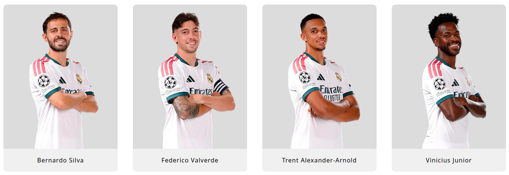
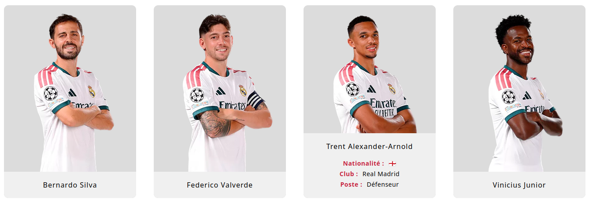

<!-- |-------------------------------------------------------------------------------------------| -->
<!-- |                                         LANGUAGE                                          | -->
<!-- |-------------------------------------------------------------------------------------------| -->
<div align="right">
  <a href="README.md">
    
  </a>
  <a href="README.en.md">
    
  </a>
</div>

<!-- |-------------------------------------------------------------------------------------------| -->
<!-- |                                          HEADER                                           | -->
<!-- |-------------------------------------------------------------------------------------------| -->
<h1 align="left">⚽ Product Card</h1>

<p align="justify">
This project is a set of three interactive cards showcasing Real Madrid players, built with HTML and CSS. It's a small styling exercise around layout and hover animation, but the card structure could easily be reused for a football-related website, or any other project requiring this type of interactive product card.
</p>

<!-- |-------------------------------------------------------------------------------------------| -->
<!-- |                                        PREVIEW                                            | -->
<!-- |-------------------------------------------------------------------------------------------| -->
## 📸 Preview

**Image of the cards without hover:**
<div align="center">
  
</div>

**Image of a card on hover:**
<div align="center">
  
</div>

<!-- |-------------------------------------------------------------------------------------------| -->
<!-- |                                        USAGE                                              | -->
<!-- |-------------------------------------------------------------------------------------------| -->
## 🚀 Running the project

<p align="justify">
To view the cards, simply open the page.html file in a browser.
</p>

<!-- |-------------------------------------------------------------------------------------------| -->
<!-- |                                    PROJECT STRUCTURE                                      | -->
<!-- |-------------------------------------------------------------------------------------------| -->
## 📁 Project structure

```text
Product-card/
├── css/
│   └── page.css
├── html/
│   └── page.html
├── img/
│   ├── img1.png
│   ├── img2.png
│   └── img3.png
└── README.md
└── README.en.md
```

<!-- |-------------------------------------------------------------------------------------------| -->
<!-- |                                      CONTRIBUTORS                                         | -->
<!-- |-------------------------------------------------------------------------------------------| -->
## 👥 Contributors

Work carried out individually as part of a personal project.

<div align="center">

[](https://github.com/rmax3iu)

</div>
